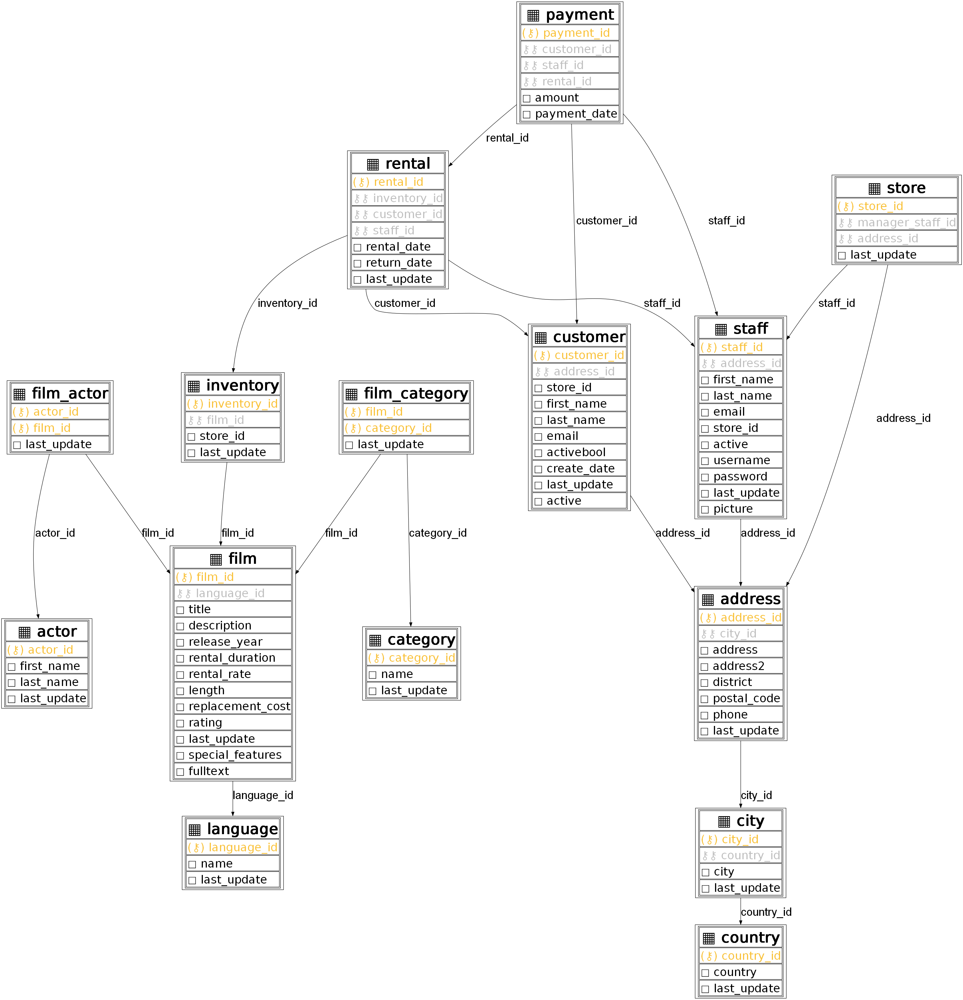
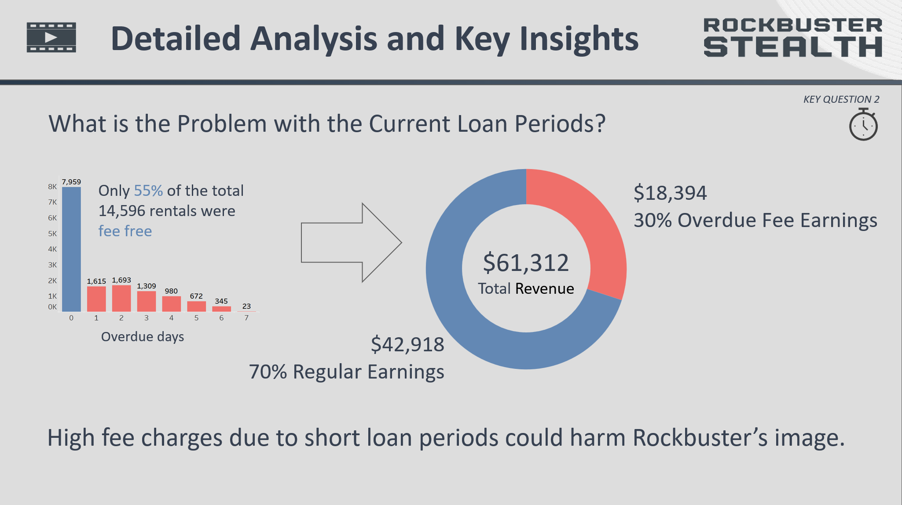

# SQL Project: Rockbuster Stealth LLC - Movie Rental Company


<br><br>

## Installation

To execute the Python scripts, please consult `scripts/python/requirements.txt` for the required dependencies.

A PostgresSQL Database must be installed with the following credentials:
``` 
"host": "localhost",
"port": 5432,
"database": "Rockbuster",
"user": "postgres",
"password": "1234"
```
The database file is located at `data/dvdrentals.tar`

<br><br>

## Links

[Powerpoint Report](analysis/Final%20Presentation.pdf)

[Tableau Repository](https://public.tableau.com/authoring/CareerFoundry_DataAnalytics_3_10_PresentingSQLResults/RevenueRentalCountRate#1)

<br><br>

## Context


Rockbuster is...
- a former movie rental company with global stores. 
- facing tough competition from streaming services like Netflix and Amazon Prime. 
- planning to launch an online video rental service (streaming) using existing movie licenses.

An **in-depth analysis** using **SQL** shall...
- build a thorough understanding of various data points
- offer data driven insights for strategic decisions

<br><br>

## Objective

Rockbuster expects data-driven answers they can use for their company strategy addressing the follwing key business question:

- Which movies contributed the most/least to revenue gain?
- What was the average rental duration for all videos?
- Which countries are Rockbuster customers based in?
- Where are customers with a high lifetime value based?
- Do sales figures vary between geographic regions?

<br><br>

## Tools

&nbsp;|&nbsp;|&nbsp;
---|---|---
**SQL** | PostgreSQL 14 <br> pgAdmin 4 v7.3 | Perform queries 
&nbsp;|&nbsp;| &nbsp;
**Python** | pandas | Data wrangling
&nbsp; | googlemaps | Curate cities data by accessing GoogleMaps API to get latitude and longitude for all cities
&nbsp; | psycopg2 | Interact with the PostgreSQL database
&nbsp; | sqlalchemy <br>sqlcodegen | Generate models from data base
&nbsp; | graphviz | construct ERD from generated models
&nbsp;|&nbsp;| &nbsp;
**Tableau Public** v2023.2 |  |Visualization
&nbsp;|&nbsp;| &nbsp;
**Powerpoint** |  |Reporting
<br><br>

## Data Set

`.data / dvdrental.tar`

Provider: https://www.postgresqltutorial.com/

Data set that contains information about Rockbuster’s film inventory, customers, and payments, among other things. See complete ERD below. The data set has 14,596 records of movie rentals from 599 customers in different cities and countries. 


ERD generated with `sqlalchemy` and `graphviz`

<br>

`.data / film_stock_course.xlsx`

Wrangled data showing rentals over time.

<br>

`.data / countries_geo.xlsx`

Curated city and country data with added latitude, longitude and regions to city data using googlemaps api and restcountries


<br><br>

## Most Intersting Finding

Upon delving into the data, I discovered that Rockbuster imposes a **$1 daily fee** for overdue rentals. Interestingly, these overdue charges contribute to **30% of the total revenue** due to short loan periods. This could raise ethical issues. Customers might argue that Rockbuster Stealth LLC intentionally sets shorter loan periods as a strategy to boost their revenue.



For the detailed in-depth analysis refer to the [complete report](analysis/Final%20Presentation.pdf).
